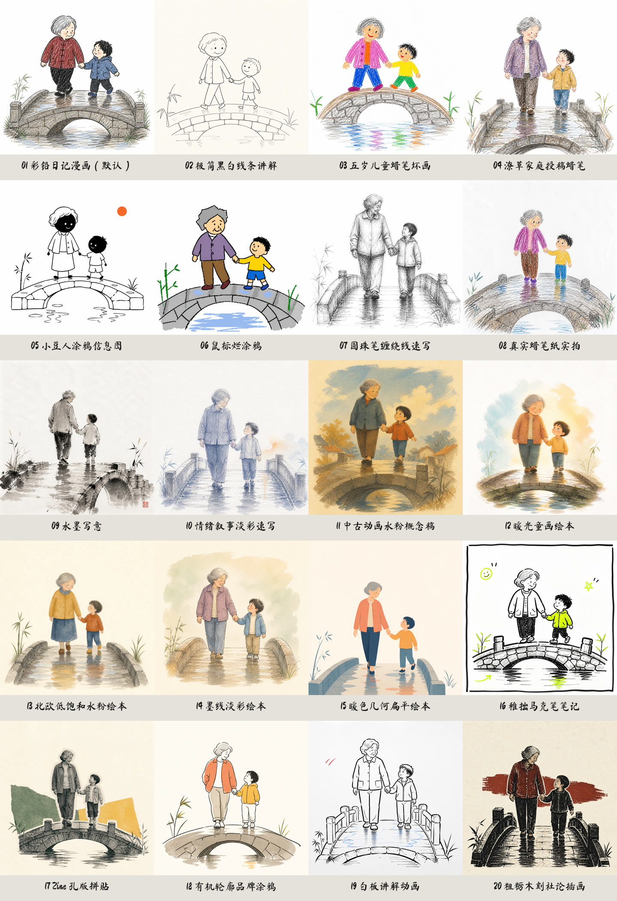

<div align="center">

# 📚 BV Workstation

### 从一本书里，讲好一个值得听完的故事

本地优先 · 人工门禁 · 可追溯清单 · 中文图书视频工作台

[](https://www.python.org/)
[](#环境要求)
[](LICENSE)
[](#开发与验证)
[](#默认成片规格)

[🚀 五分钟上手](#五分钟上手) · [🧭 生产流程](#一条视频是怎么跑出来的) · [🤖 交给 Agent](#直接交给-agent) · [🧑‍🏫 小白复刻教程](docs/agent-rebuild-guide.zh-CN.md)

</div>

---

BV Workstation 是一个面向 Windows 的图书故事视频工作台。它接收书名加作者，或一份合法可读的 TXT、PDF、EPUB 文件，在 Agent 对话中完成来源核验、人物视角长稿、音色筛选、配音、字幕、成对连续画面、竖屏渲染、独立封面和最终验收。

当前创作路线见 [长篇故事生产手册](docs/runbooks/longform-story-production.md)。Agent 总入口为 [图书视频生产 Skill](skills/producing-book-handdrawn-videos/SKILL.md)，故事小节和视觉规格由两个专项 Skill 维护。文稿按故事完整性决定长度，常用预算 6–8 分钟，10 分钟为软提醒；声音从候选池中按故事筛选，AB 套图按语义节点增加。文稿直接写作，不依赖去 AI 味 Skill。旧短视频模式保留兼容。

它没有假装一条命令就能替你做完所有判断。文稿、音色、代表图和成片都有明确停点，只有得到批准，流水线才会继续消耗下一阶段的资源。

## 它解决了什么

<table>
<tr>
<td width="33%" valign="top">

### 🧠 整本书理解

标题作者模式会先建立书籍身份和证据边界。文稿围绕一个核心故事，以事件、冲突、应对和结果推进。

</td>
<td width="33%" valign="top">

### 🚦 分阶段批准

先文稿，再试听，再代表图，最后成片。批准记录与 SHA-256 绑定，旧批准不会悄悄套到新内容上。

</td>
<td width="33%" valign="top">

### 🧾 可核验交付

最终包包含音频、字幕、画面、封面、渲染事实和 QC 清单。进程结束不等于成片合格。

</td>
</tr>
<tr>
<td width="33%" valign="top">

### 🎙️ 多供应商边界

支持豆包长文本 TTS、火山 ASR、本地 IndexTTS2 等路线。凭据只从环境变量读取，真实调用默认关闭。

</td>
<td width="33%" valign="top">

### 🎨 连续 AB 叙事

按故事安排多组 AB 画面，每组从初始处境走到经历剧情发展后的高潮或结果。先审三组完整代表图，再补齐其他组；最终配音与 ASR 决定转折时间。

</td>
<td width="33%" valign="top">

### 🔒 本地优先

电子书、私人笔记、试听音频、供应商回执和成片默认留在被 Git 忽略的工作区中。

</td>
</tr>
</table>

## 一条视频是怎么跑出来的


> 外部服务调用需要当前请求的明确授权。任何阶段失败都会停在原地，不自动换供应商，也不把失败伪装成完成。

## 成片规格与旧模式兼容

长篇故事以 `ProductionProfile.longform_story_default()` 为配置，使用动态 AB 数量、十分钟软提醒和直接写作文稿门禁。`bv import-story --help` 查看候选登记入口；`bv voice-pool --help` 查看只读音色筛选入口。候选音色尚待实际试听，不代表热度排名或账户可用性已经核验。

以下为保留兼容的旧短视频配置：

| 项目 | 新建标题作者短视频 |
| --- | --- |
| 口播时长 | 硬范围 30–45 秒，目标 35–40 秒 |
| 背景图 | 总计 4 张 |
| 固定画风 | 第 11 种 `retro-gouache-concept`，中古动画水粉概念稿 |
| 代表图门禁 | 开头、中段、结尾 3 张 |
| 视频 | 1080×1920，30fps，H.264/yuv420p |
| 转场 | 15 帧交叉溶解 |
| 音频 | 48 kHz 最终母带，AAC 双声道交付 |
| 独立封面 | 1080×1440，3:4，单独审批 |
| 平台上传 | 不包含，必须另行授权 |

旧 Episode 没有 `production_profile.json` 时仍保留 45–60 秒兼容配置。新旧配置不会混用。

<details>
<summary><strong>看看内置画风目录</strong></summary>



</details>

## 环境要求

- Windows 10 或 Windows 11
- Python 3.11
- [uv](https://docs.astral.sh/uv/)
- FFmpeg 和 FFprobe
- Node.js 与 npm
- 一个能在项目目录内读写文件和运行命令的 Agent
- 按选定路线准备本地 IndexTTS2，或自己的豆包 TTS、火山 ASR 账号

仓库不会提供电子书、音色样本、云服务额度或第三方平台凭据。请只处理你有权使用的内容。

## 五分钟上手

### 1. 克隆与安装

```powershell
git clone https://github.com/kaiteJiang/book-video-workstation.git
Set-Location book-video-workstation
uv sync --group dev
```

### 2. 建立本机配置

```powershell
Copy-Item config.example.yaml config.yaml
uv run bv doctor
```

打开 `config.yaml`，把 FFmpeg、FFprobe、字幕字体和本地模型路径改成你机器上的真实位置。敏感值不要写进这个文件。

### 3. 新建一本书

只有书名和作者时：

```powershell
uv run bv new --title "遥远的救世主" --author "豆豆"
```

已有合法可读文件时：

```powershell
uv run bv new .\book.txt --title "书名" --author "作者"
```

命令会返回 `book_id`。先检查当前状态，不要立刻开放外部调用：

```powershell
uv run bv status --book-id <book_id>
uv run bv next <book_id>
```

只有用户明确授权当前阶段时，Agent 才能在对应命令上使用 `--allow-external`。

## 直接交给 Agent

把下面这段连同仓库地址交给你的 Agent：

```text
请接手这个图书视频项目。先读 AGENTS.md、README、config.example.yaml 和
docs/runbooks/longform-story-production.md，再运行只读的环境检查与项目状态检查。
不要打印或提交任何密钥、Cookie、电子书正文、私人笔记和供应商原始响应。

输入是书名加作者，或我有权使用的 TXT、PDF、EPUB 文件。
用第一视角优先的直接写作方式，讲透一个最值得说的故事，不使用去 AI 味 Skill。
严格按门禁推进：先给我确认完整长稿，再做同片段音色试听，再做三组完整 AB 代表图，
批准后按语义补齐其余 AB，最后渲染竖屏视频和 3:4 独立封面。
长度由故事决定，常用 6–8 分钟，优先控制在 10 分钟内，不凑时长。
画风固定使用第 11 种 retro-gouache-concept。
每次准备调用外部服务前，说明服务、输入、预计产物和是否可能收费，等我批准。
没有真实媒体、清单、探测结果和 QC 报告时，不要声称已经完成。
不要上传任何平台。
```

更完整、适合第一次使用 Agent 的任务书见 [《把这个仓库丢给 Agent，复刻一条图书视频》](docs/agent-rebuild-guide.zh-CN.md)。

## 常用命令

```powershell
uv run bv doctor
uv run bv new --title "书名" --author "作者"
uv run bv status --book-id <book_id>
uv run bv next <book_id>
uv run bv open <book_id> <episode_id> <target>
uv run bv approve <book_id> <episode_id> <gate>
uv run bv retry <book_id> --episode-id <episode_id>
```

完整参数以 `uv run bv --help` 和子命令的 `--help` 为准。手绘成片的后半段是对话内编排流程，目前没有承诺一个全自动网页或单独的“一键成片”CLI。

## 隐私和授权边界

- `.env`、`config.yaml`、`workspace/books/`、`workspace/voices/`、日志、缓存和临时文件默认不进入 Git。
- 代码只保存环境变量的名字，不保存密钥本身。
- 供应商调用使用请求级授权。一次批准不会自动延伸到重试、换音色或换供应商。
- 公开交接只带代码、脱敏清单和自有文稿，不带电子书正文、私人来源 URL、Cookie、签名 URL 和原始回执。
- 最终视频和封面必须由人完整查看后才能写入最终批准记录。

## 项目结构

```text
src/bv/                         Python 编排、合同、门禁与 CLI
tests/                          单元、集成、真实渲染与安全边界测试
vendor/story_to_handdrawn_video 内置 Remotion 手绘渲染器及来源记录
docs/runbooks/                  实际生产手册
docs/superpowers/               设计与实施历史
workspace/                      本地书籍、媒体、回执和交付物，默认忽略
```

## 开发与验证

```powershell
uv sync --group dev
uv run pytest -q
git diff --check
```

测试覆盖内容合同、运行时授权、TTS/ASR 边界、音频规范化、字幕、四图分镜、代表图门禁、Remotion 渲染、FFmpeg 合成、封面和最终批准记录。真实云端账号、额度和审美判断仍需使用者自行验收。

## 许可证与致谢
借鉴了 @gnipbao 大佬的插画开源项目，特此感谢。

项目主体采用 [MIT License](LICENSE)。内置渲染器、画风定义和字体保留各自许可证，详情见 [THIRD_PARTY_NOTICES.md](THIRD_PARTY_NOTICES.md)。

欢迎大家去二创完善，任何一个模块都是可以自定义修改 替换 甚至开发升级的。期待大家的版本，记得回来@我分享！

<div align="center">

### 如果它帮你少踩了一个坑，欢迎点一颗 ⭐

Made for people who want agents to produce evidence, not just confidence.

</div>
